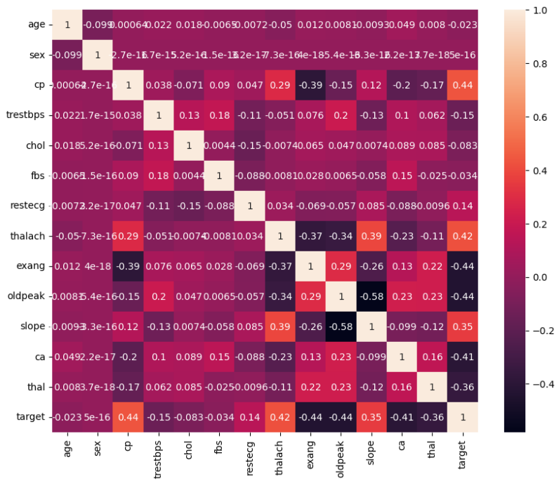

# Laporan Proyek Machine Learning

### Nama : Irgiyansyah

### Nim : 211351068

### Kelas : Malam B

## Domain Proyek

Proyek ini bertujuan untuk membangun model prediksi sakit jantung. Model ini diharapkan dapat membantu tenaga medis dalam mendiagnosis sakit jantung secara lebih akurat dan efisien.

## Business Understanding

Membantu tenaga medis dalam mendiagnosis sakit jantung secara lebih akurat dan efisien.

### Problem Statement

Penyakit jantung adalah salah satu penyebab kematian tertinggi di dunia. Penting untuk dapat memprediksi siapa yang berisiko terkena penyakit jantung sehingga dapat dilakukan tindakan pencegahan.

### Goals

Tujuan dari proyek ini adalah untuk membantu tenaga medis dalam:

-   Mendiagnosis penyakit jantung dengan menggunakan beberapa variabel
-   Upaya pencegahan yang dapat dilakukan sedini mungkin dengan hasil prediksi

### Solution Statements

-   Menganalisis faktor-faktor yang paling berpengaruh pada penyakit jantung sehingga dapat melakukan tindakan preventif
-   Memprediksi penyakit jantung dengan menggunakan datasets dari kaggle dan membut model prediksi dengan menggunakan algoritma `Logistic Regression`

## Data Understanding

Dataset "Diabetes, Hypertension and Stroke Prediction" adalah data yang saya dapatkan dari platform kaggle. Dataset ini merupakan hasil dari _70,692 respon survei BRFSS 2015_. Data yang saya gunakan adalah data _hypertension_ tetapi sumber datanya menyebutkan itu adalah data _heart disease_.
<br>
[Diabetes, Hypertension and Stroke Prediction](https://www.kaggle.com/datasets/prosperchuks/health-dataset)

### Variabel-variabel pada Heart Disease Prediction adalah sebagai berikut:

|

-   age : Umur pasien (dalam tahun) _`float64`_
-   sex : Jenis Kelamin [0: Perempuan, 1: Laki-laki] _`float64`_
-   cp : Tipe sakit dada [0: asymptomatic 1: typical angina 2: atypical angina 3: non-anginal pain] _`int64`_
-   trestbps : Tekanan darah mmHg _`int64`_
-   chol : Serum kolesterol mm/dl _`int64`_
-   fbs : Jika kadar gula darah puasa > 120 mg/dL [0: Tidak: 1: Ya] _`int64`_
-   restecg : Elektrokardiografi (EKG) istirahat [0: Normal , 1: ST-T Abnormal , 2: Left ventricular ] _`int64`_
-   thalach : Denyut jantung maksimum _`int64`_
-   exang : Angina akibat olahraga [0: Tidak, 1: Ya] _`int64`_
-   oldpeak : Depresi ST disebabkan oleh olahraga _`float64`_
-   slope : Slope dari segmen ST yang terjadi selama puncak olahraga [0: Upsloping, 1: Flat, 2: Downsloping] _`int64`_
-   ca : Jumlah pembuluh darah selama prosedur flouroskopi _`int64`_
-   thal : Thalamesia [1: Normal , 2: Fixed defect , 3: Reversable"] _`int64`_

## Data Prepartaion

Pada tahap ini saya melakukan data preparataion dengan metode Exploratory Data Analysis

### Persiapan bekerja dengan Kaggle

Karena saya menggunakan Google Colaboratory pertama saya akan upload file `kaggle.json` yang dimana ini akan digunakan untuk mengunduh datasets dari kaggle

```python
from google.colab import files
files.upload()
```

Setelah file `kaggle.json` diupload maka selanjutnya saya akan membuat direktori `~/.kaggle` dan men-copy file `kaggle.json` kedalam direktori tersebut lalu mengubah file permissin nya menjadi 600

```python
!mkdir -p ~/.kaggle
!cp kaggle.json ~/.kaggle/
!chmod 600 ~/.kaggle/kaggle.json
!ls ~/.kaggle
```

### Unduh datasets

Setelah persiapan Kaggle selesai selanjutnya mengunduhh datasets dengan perintah :

```python
!kaggle datasets download -d prosperchuks/health-dataset
```

### Extract file

Untuk mendapatkan file datasets nya yaitu berupad `csv` selanjutnya saya akan mengekstrak file `zip` hasil mengunduh diatas dan simpan kedalam direktori `health-dataset`

```python
!mkdir health-dataset
!unzip health-dataset.zip -d health-dataset
!ls health-dataset
```

Setelah didapatkan file `hypertension_data.csv` maka kita siap menggunakan datasetsnya.

### Import library yang diperlukan

Selanjutnya saya akan mengimport library yang akan digunakan.

```python
import numpy as np
import pandas as pd
import matplotlib.pyplot as plt
import seaborn as sns

from sklearn.model_selection import train_test_split
from sklearn.linear_model import LogisticRegression
from sklearn.metrics import accuracy_score
```

### Inisialisasi DataFrame

Saya akan menginisialisi data frame dengan perintah berikut :

```python
df = pd.read_csv("health-dataset/hypertension_data.csv")
```

Selanjutnya saya akan melihat 5 sampel data teratas

```python
df.head()
```

Kemudian untuk melihat tipe data pada setiap kolom dapat menggunakan perintah berikut :

```python
df.info()
```

### Data Cleansing

Pada tahap ini saya akan membersikan data yang tidak diperlukan ataupun yang akan mengganggu pada tahap berikutnya. <br>
Pertama saya akan cek data null pada setiap kolom

```python
df.isnull().sum()
```

Kemudian saya akan menghapus data null tersebut dengan perintah :

```python
df = df.replace([np.inf, -np.inf], np.nan)
df = df.dropna()
df = df.reset_index(drop=True)
```

Kemudian saya akan melihat data duplikat

```python
df[df.duplicated()].value_counts()
```

Lalu menghapusnya dengan perintah berikut

```python
df.drop_duplicates(inplace=True)
```

### Pemerikasaan lebih lanjut

Setelah proses cleansing selesai selanjutnya saya akan memastikan apakah dataframe memiliki masih nilai null

```python
sns.heatmap(df.isnull())
```


Baik terlihat aman, Selanjutnya saya akan melihat korelasi matriks antara kolom satu dengan yang lainnya

```python
sns.heatmap(df.corr(), annot=True)
```


Dapat dilihat pada heatmap diatas cp, restecg, thalach, slope memiliki korelisi pada target yang lebih tinggi dibandingkan kolom yang lain

## Modeling

Pada tahap ini saya akan membuat feature dari semua kolom kecuali kolom `target` yang dimana akan saya jadikan sebagai label dengan perintah berikut :

```python
X = df.drop(columns="target", axis=1)
Y = df["target"]
```

Selanjutnya saya akan membagi datasets menjadi dua subset, yaitu train set dan test set, 0.2 atau 20% akan dimasukan kedalam test set sedangkan sisanya kedalam train set, dengan stratified split metode pembagian data memastikan bahwa distribusi label di antara train set dan test set tetap sama.

```python
X_train, X_test, Y_train, Y_test = train_test_split(X, Y, test_size=0.2, stratify=Y, random_state=2)
```

Kemudian saya akan membuat model dengan algoritma `LogisticRegression` dengan menggunakan max iterasi sebanyak 1000 untuk menghilangkan `ConvergenceWarning`

```python
model = LogisticRegression(max_iter=1000)
```

Setelah itu memasukan `X.train` dan `Y.train` kedalam model

```python
model.fit(X_train, Y_train)
```

Kemudian lakukan prediksi dan hitung akurasi model `X.train`

```python
X_train_prediction = model.predict(X_train)
training_data_accuracy = accuracy_score(X_train_prediction, Y_train)
print("Akurasi data training : ", training_data_accuracy)
```

Score akurasi dari model `Akurasi data training :  0.8608845821740382` cukup memuaskan, lalu untuk akurasi test data

```python
X_test_prediction = model.predict(X_test)
test_data_accuracy = accuracy_score(X_test_prediction, Y_test )
```

Hasil `Akurasi data test :  0.8610897927858787` tidak jauh berbeda yang dimana itu sudah aman untuk model prediksi. Selanjutnya saya akan coba tes prediksi dengan sampel data teratas

```python
input_data =  np.array([57.0,1.0,3,145,233,1,0,150,0,2.3,0,0,1])
input_data_reshaped = input_data.reshape(1,-1)
prediction = model.predict(input_data_reshaped)
print(prediction)
if (prediction[0] == 0) :
    print("Pasien tidak terkena penyakit jantung")
else :
    print("Pasien terkena penyakit penyakit jantungi")
```

Dan outputnya `Pasien terkena penyakit penyakit jantungi` yang dimana prediksi berhasil, setelah itu saya perlu export data model menjadi file `.sav` untuk digunakan pada aplikasi `streamlit`

```python
import pickle
filename = 'heart_disease.sav'
pickle.dump(model, open(filename, 'wb'))
```

## Evaluation

## Deployment
